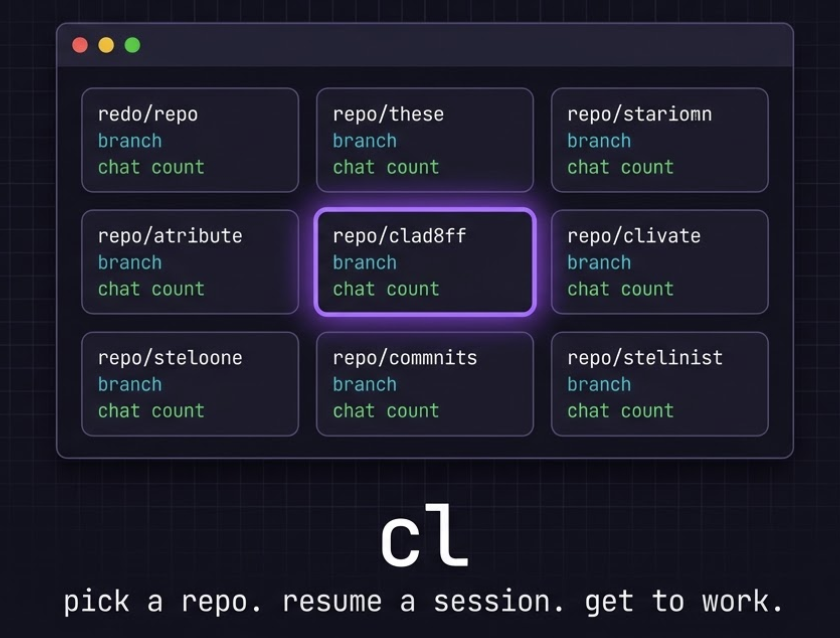

<div align="center">



<br><br>

**stop wasting 30 seconds every time you open a terminal.**

[](https://python.org)
[](LICENSE)
[]()

</div>

---

## the problem

you open terminal. you `cd` into a repo. you run `claude`. you type `--resume`. you try to remember which session you were in. you pick the wrong one. you start over.

**every. single. time.**

## the fix

```bash
cl
```

that's it. one command. visual grid of all your repos + sessions. arrow keys. enter. done.

---

## what it looks like

**repo grid** -- arrow keys navigate, enter selects:

```
  claude Workspace Launcher
  arrows navigate  |  Enter select  |  Esc quit       [1-4/7 rows]

  +----------------------------+  +----------------------------+  +----------------------------+
  | my-web-app                 |  | api-gateway                |  | auth-service               |
  | ~ main                    |  | ~ feat/rate-limit          |  | ~ main                     |
  | [24 chats]  3h ago        |  | [8 chats]  1d ago          |  | [15 chats]  2d ago         |
  | "fix responsive layout.." |  | "add redis caching laye.." |  | "rotate token signing k.." |
  +============================+  +----------------------------+  +----------------------------+
  +----------------------------+  +----------------------------+  +----------------------------+
  | infra-terraform            |  | docs-portal                |  | ml-pipeline                |
  | ~ main                    |  | ~ redesign                 |  | ~ experiment/bert          |
  | [3 chats]  5d ago         |  | [12 chats]  1w ago         |  | [6 chats]  2w ago          |
  | "migrate to azurerm 4.."  |  | "rewrite search compon.."  |  | "tune hyperparameters .."  |
  +----------------------------+  +----------------------------+  +----------------------------+

  repo:  my-web-app  |  main  |  24 chats  |  last active: 3h ago
```

**session picker** -- resume where you left off:

```
  my-web-app  |  main  |  ~/repos/my-web-app
  up/down navigate  |  Enter select  |  r rename  |  d hide  |  Esc back

  +============================================================+
  | +  Start New Chat                                > enter   |
  +============================================================+
  +------------------------------------------------------------+
  | 3h ago  |  66 msgs  |  main                                |
  | "fix responsive layout"  ->  "add mobile breakpoints"      |
  +------------------------------------------------------------+
  +------------------------------------------------------------+
  | 1d ago  |  85 msgs  |  feat/auth                           |
  | * "token refresh overhaul"                                 |
  +------------------------------------------------------------+
  +------------------------------------------------------------+
  | 3d ago  |  34 msgs  |  main                                |
  | "set up CI pipeline"  ->  "add deploy stage for stag.."    |
  +------------------------------------------------------------+

  2 hidden, h to show
```

**session rename** -- press `r` on any session to replace the cryptic auto-summary with your own label. it sticks across launches:

```
  before:
  +------------------------------------------------------------+
  | 1d ago  |  85 msgs  |  feat/auth                           |
  | "fix the thing"  ->  "ok now run tests again"              |
  +------------------------------------------------------------+

  > press r, type "token refresh overhaul"

  after:
  +------------------------------------------------------------+
  | 1d ago  |  85 msgs  |  feat/auth                           |
  | * "token refresh overhaul"                                 |
  +------------------------------------------------------------+
```

labels are saved locally in `~/.claude-launcher/session-labels.json` -- your Claude session files are never touched.

**launch confirmation** -- see exactly what runs before it does:

```
  >>  Ready to launch

  repo:     my-web-app
  path:     ~/repos/my-web-app
  branch:   main
  session:  "fix responsive layout"  ->  "add mobile breakpoints"
  messages: 66
  last:     3 hours ago

  command:  cd "~/repos/my-web-app" && claude --resume a1b2c3d4-e5f6-...

  launching...
```

---

## install

```bash
git clone https://github.com/asaf5767/claude-launcher.git
cd claude-launcher
pip install .
```

requires python 3.10+ and an AI coding tool (claude, copilot, whatever).

first run triggers a setup wizard. or skip it -- defaults work fine.

---

## usage

```bash
cl                              # launch the picker
cl --repo api                   # jump straight to "api*" repo sessions
cl --dry-run                    # print command, don't execute
cl --command my-custom-tool     # use a different tool this time
cl --setup                      # re-run the config wizard
cl --help                       # you know the drill
```

also installs as `claude-launcher` if you prefer the long name.

---

## keybindings

### repo grid

| key | action |
|-----|--------|
| `arrows` | navigate the card grid |
| `Enter` | select repo, go to sessions |
| `Esc` | quit |

### session list

| key | action |
|-----|--------|
| `up/down` | navigate sessions |
| `Enter` | resume session (or start new chat) |
| `r` | rename -- give session a custom label |
| `d` | hide session (soft, reversible) |
| `h` | toggle hidden sessions visibility |
| `D` | **permanently delete** session file (requires typing DELETE) |
| `Esc` / `q` | back to repo grid |

---

## how it works

```
you type `cl`
     |
     v
 scan repos dirs         <-- reads ~/repos/* (or your configured dirs)
     |
     v
 scan ~/.claude/projects/ <-- finds all session .jsonl files
     |                        extracts first/last prompt, branch, timestamps
     v
 render card grid         <-- Rich panels, arrow-key navigation, viewport scroll
     |
     v
 render session list      <-- boxed rows with "first" -> "last" journey display
     |
     v
 verbose confirmation     <-- shows exact command before executing
     |
     v
 exec claude --resume ID  <-- replaces process, you're coding
```

session data is always read from **Claude Code's storage** (`~/.claude/projects/`), regardless of which tool you launch. custom commands get the same `--resume` flag appended.

---

## config

stored at `~/.claude-launcher/config.json`. edit directly or use `cl --setup`.

```json
{
  "repos_dirs": ["~/repos", "/mnt/work/projects"],
  "ai_tool": "claude",
  "custom_command": "",
  "card_density": "standard",
  "max_sessions_shown": 15,
  "show_empty_repos": false,
  "setup_complete": true
}
```

additional data files (same directory):

| file | what it stores |
|------|----------------|
| `session-labels.json` | your custom session names (`r` key) |
| `hidden-sessions.json` | soft-hidden session IDs (`d` key) |

---

## custom tools

the launcher doesn't care what AI tool you use. it launches whatever you tell it to.

```bash
# one-time override
cl --command "my-wrapper --fast"
cl --command copilot

# permanent (via wizard or config.json)
{
  "ai_tool": "custom",
  "custom_command": "my-wrapper --fast"
}
```

your custom command gets `--resume <session-id>` appended when resuming.
flags in the command string are preserved: `my-wrapper --fast --resume abc123`.

---

## project structure

```
src/claude_launcher/
    __main__.py          # argparse, launch flow, error handling
    config.py            # config, labels, hidden sessions, shared console
    keyboard.py          # cross-platform raw key input (win32 + unix)
    data/
        discovery.py     # parallel repo scanning, session parsing
        models.py        # Session, RepoInfo dataclasses, prompt cleaning
    ui/
        repo_picker.py   # Rich card grid with viewport scrolling
        session_picker.py # session list with rename/hide/delete
        wizard.py        # 6-step interactive setup
```

---

## contributing

PRs welcome. please open an issue first for anything non-trivial.

```bash
git clone https://github.com/asaf5767/claude-launcher.git
cd claude-launcher
pip install -e .
python tests/test_all.py    # 13 tests, all should pass
cl --setup                  # configure for your machine
```

---

## license

MIT. see [LICENSE](LICENSE).

---

<div align="center">

*built because `cd && claude --resume` got old real fast.*

</div>
